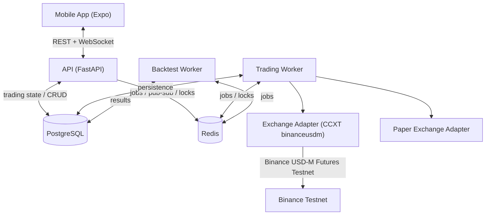
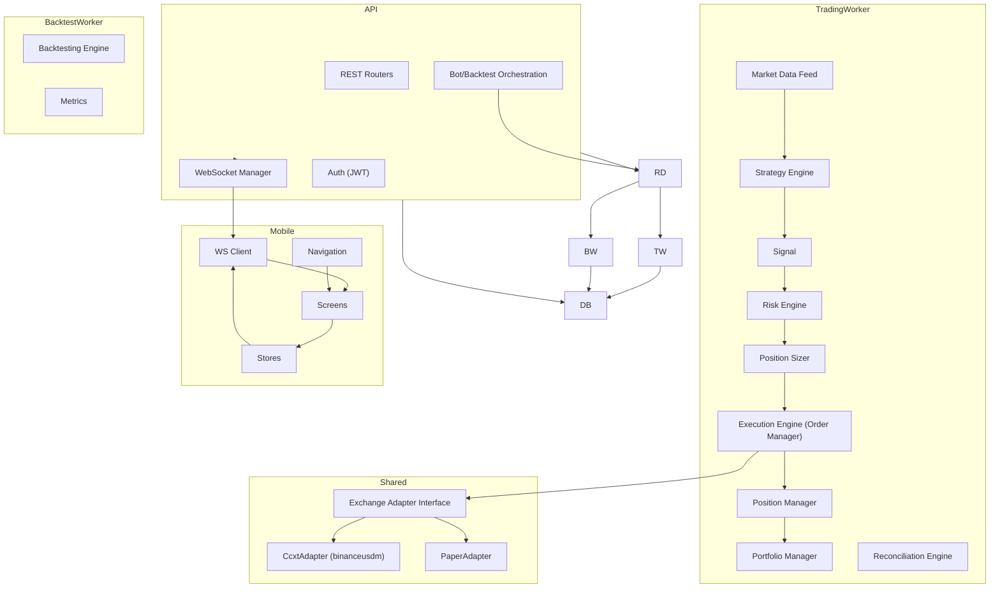
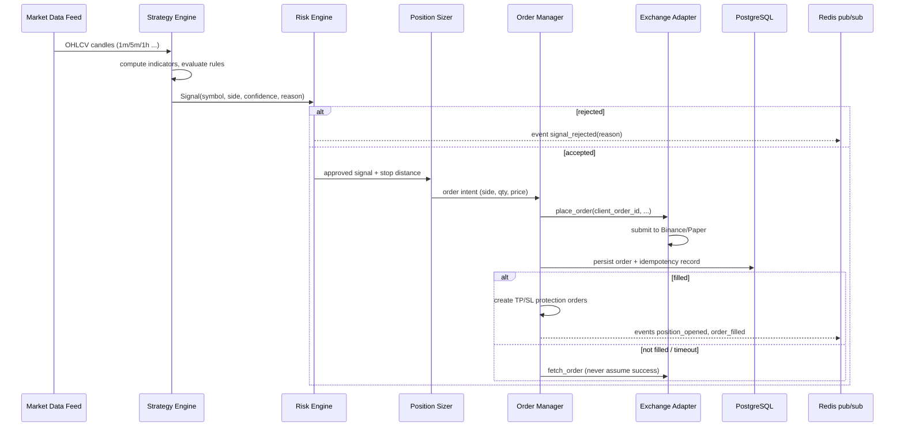
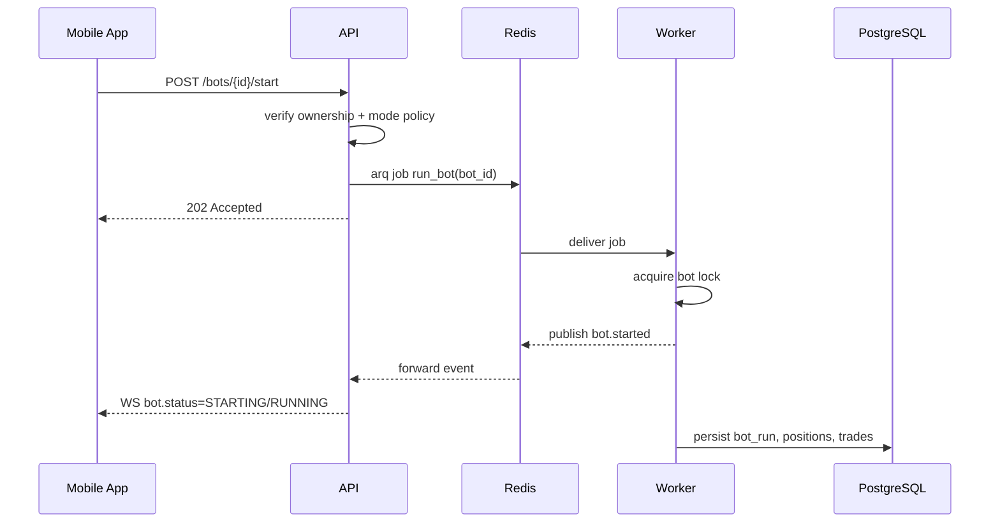
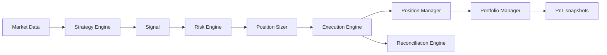
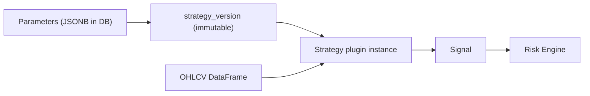
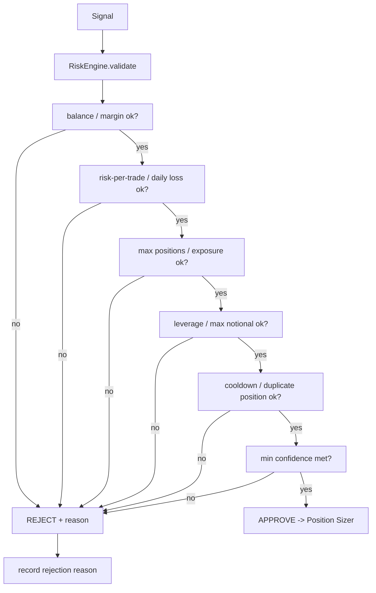
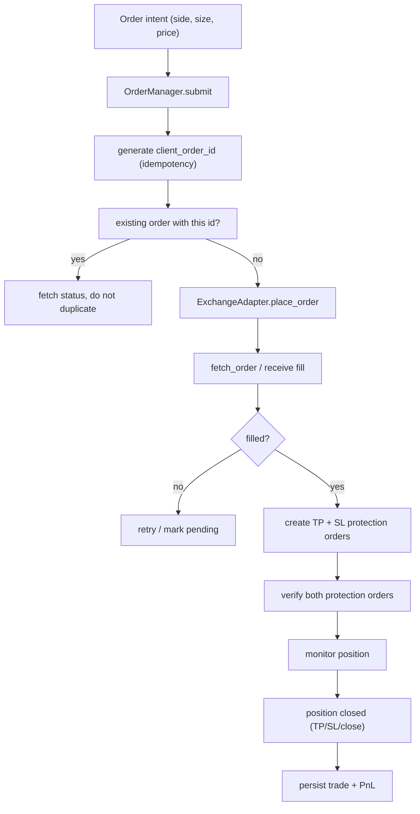
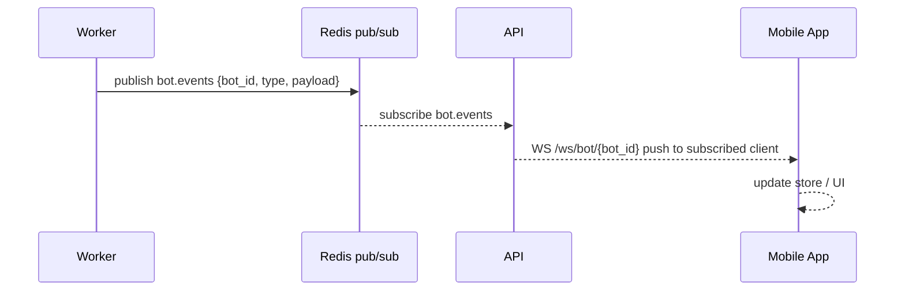
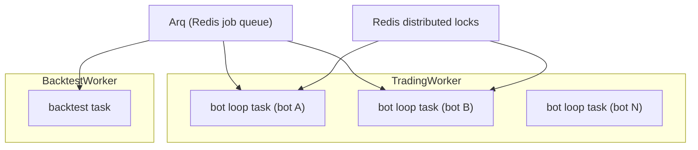

# Architecture

Mobile-first crypto strategy research, paper-trading, Binance Testnet trading, and future SaaS platform.

## 1. System Overview

The system is a **modular monolith plus separate workers**. There are exactly three deployable
Python services and one mobile app, sharing one PostgreSQL database and one Redis:

| Unit | Responsibility |
|------|----------------|
| **API** (FastAPI) | REST + WebSocket for mobile, authentication, CRUD, orchestration (start/stop bots, submit backtests), health checks |
| **Trading Worker** | Runs bots: market data → strategy → risk → sizing → execution → position management → PnL |
| **Backtest Worker** | Consumes backtest jobs from Redis, computes metrics, writes results |
| **Mobile App** (React Native + Expo) | Control and monitoring client only. Never runs the trading engine |

The trading engine continues running when the mobile app is closed because all execution lives
in the workers, not the phone.



The three Python services share code via local packages under `packages/` (trading-core, exchange).
This is **not** microservices: API, Trading Worker, and Backtest Worker are built from the same
repository, share the same database, and are deployed together with Docker Compose.

## 2. Component Diagram



## 3. Data Flow — Signal to Execution (one bot tick)



## 4. Mobile / Backend Communication

- **REST** (JSON over HTTPS) for: auth, strategies, versions, bots, backtests, exchange accounts,
  positions, orders, trades, PnL, dashboard, signals, notifications.
- **WebSocket** for real-time: bot status, new signals, order updates, position updates, PnL updates.
- The mobile app is a **thin client**: all decisions (risk, sizing, execution) are made by the backend.
- Long-running work (backtests, bot lifecycle transitions) is never performed inside an HTTP request;
  the API enqueues jobs and the worker reports progress via Redis pub/sub → WebSocket.



## 5. Trading Engine Flow

The trading engine is the code inside the Trading Worker. It is a single asyncio loop that owns
one task per running bot (plus shared market-data subscribers). Order of responsibilities:

1. **Market Data** — fetch/cache OHLCV; maintain a rolling buffer per (symbol, timeframe);
   reconnect on failure; handle stale/missing/duplicate candles and timestamp skew.
2. **Strategy Engine** — resolves the immutable `strategy_version`; instantiates the strategy plugin
   with its parameters; runs on each completed candle.
3. **Signal Engine** — produces `Signal` objects (BUY/SELL/HOLD) with confidence 0..1.
4. **Risk Engine** — validates every signal against account balance, risk per trade, daily loss,
   max drawdown, max positions, symbol exposure, leverage, min confidence, cooldown, duplicate
   position, max notional, available margin. Rejections are recorded with reasons.
5. **Position Sizer** — risk-based sizing: `risk_amount = equity * risk_per_trade`,
   `size = risk_amount / stop_distance`; validates min qty, step size, tick size, min notional,
   margin. Uses `Decimal`.
6. **Execution Engine (Order Manager)** — validation, submission (idempotent client order ID),
   status polling, fills, cancellation, retries, reconciliation.
7. **Position Manager** — TP/SL protection, trailing stop, liquidation-distance monitoring,
   emergency handling.
8. **Portfolio Manager** — balances, equity, PnL snapshots.
9. **Reconciliation Engine** — periodic diff of local DB vs exchange; marks system DEGRADED and
   stops new entries on mismatch.



## 6. Strategy Flow

**Critical rule:** strategy code is completely decoupled from exchange, risk, database, and UI.

- A strategy is a pure Python class in `packages/trading-core/strategy/` registered by a
  `strategy_type` key.
- It exposes only: `initialize()`, `calculate_indicators()`, `generate_signal()`,
  `validate_signal()`. Inputs are market data (pandas DataFrame) and validated parameters.
- Output is a `Signal` dataclass: symbol, timeframe, side, confidence, timestamp, strategy_id,
  strategy_version, reason, metadata.
- Strategies do **not** import the exchange adapter, execute orders, or touch the database.
- Parameter changes from mobile create a **new immutable strategy version**; a running bot always
  references the version it started with.



## 7. Risk Flow

Every signal passes through the RiskEngine before any order intent is created.



## 8. Order Execution Flow



- Never assume API success = filled; always query actual order status.
- TP/SL protection failure → stop new trades for that position and trigger emergency notification.
- Reconciliation compares local vs exchange on a schedule.

## 9. Database Flow

PostgreSQL is the **source of truth** for all persistent state. Redis holds only ephemeral state
(job queues, pub/sub, locks, cache, temporary bot status).

Core tables (all user-owned tables carry `user_id`; `organization_id`/`workspace_id` columns are
added now for SaaS, nullable and unused in single-user mode):

```
users, organizations, memberships
strategies, strategy_versions, strategy_parameters
bots, bot_runs
exchange_accounts, exchange_credentials
market_data_sources
signals, orders, positions, trades, balances, pnl_snapshots
backtests, backtest_trades, backtest_metrics
notifications, audit_logs
usage_metering            (SaaS prep)
```

- All queries are scoped by the authenticated user (tenant isolation by construction).
- Transactional boundaries: trade creation, order state changes, strategy version creation,
  bot state transitions, PnL updates.
- Alembic manages schema migrations.

## 10. WebSocket Flow



- Channels: `/ws/dashboard` (aggregate snapshot + events), `/ws/bot/{bot_id}` (per-bot events).
- Events: bot_status, signal, order_update, position_update, pnl_update, notification.
- Reconnect with exponential backoff; resync from REST on reconnect.

## 11. Worker Architecture



- One bot loop task per running bot; each must hold lock `bot:{id}:lock` before running
  (prevents two workers running the same bot).
- Workers are stateless across restarts: on start they load bot state from DB, query the exchange,
  reconcile, and resume only if state is safe.
- Backtests run on separate workers/processes so they never block the trading loop.

## 12. Paper Trading Architecture

Paper trading uses the **same engine** as live trading; only the exchange adapter changes.

- `PaperAdapter` implements the `ExchangeAdapter` interface with a simulated wallet:
  fills, fees, slippage, balance, positions, TP/SL, PnL.
- Market data for prices comes from the real market feed (or historical candles), so paper bots
  react to real prices without creating orders.
- Execution assumptions (fee rate, slippage model) are configurable, never "fill = candle close".
- Acceptance: a bot can run for hours with **no exchange credentials**.

## 13. Binance Testnet Architecture

- `CcxtAdapter` targets `binanceusdm` (Binance USDⓈ-M Futures) in testnet mode via CCXT.
- Testnet uses the same strategy, risk, sizing, execution, and reconciliation code as paper/live.
- Integration tests against Testnet are opt-in and never run in normal CI.
- Live mode is a **configuration toggle**: `LIVE_TRADING_ENABLED=false` by default; enabling
  requires explicit confirmation (see SECURITY.md).

## 14. Future SaaS Architecture

The single-user architecture becomes multi-tenant without restructuring:

- `organizations`, `memberships`, `plans`, `subscriptions`, `usage` tables exist from day one.
- Tenancy is enforced by chained FastAPI dependencies that scope every query by the authenticated
  user (and later by workspace/org membership).
- Workers scale horizontally; Redis locks keep one execution per bot.
- Billing (Stripe) is behind a feature flag (`BILLING_ENABLED=false`) and is not part of MVP.
- The `ExchangeAdapter` interface already allows adding Bybit, OKX, Coinbase later.

## 15. Proposed Project Structure

One repository, a modular monolith. `apps/` holds deployable units, `packages/` holds shared
Python libraries, `infrastructure/` holds ops/migrations, `docs/` and `tests/` at the root.
Only Phase 0 directories exist today (`docs/`); the rest are created incrementally per phase.

```text
.
├── apps/
│   ├── api/                    # FastAPI app (REST + WebSocket + auth + orchestration)
│   │   └── app/
│   │       ├── api/routes/     # health, auth, users, strategies, bots, backtests, trading,
│   │       │                   #   notifications, exchange, dashboard
│   │       ├── auth/           # security.py, schemas, service, dependencies
│   │       ├── users/
│   │       ├── strategies/
│   │       ├── bots/
│   │       ├── backtests/
│   │       ├── trading/        # mode gate (LIVE), orchestration
│   │       ├── notifications/
│   │       ├── exchange/       # accounts CRUD, credential encryption
│   │       ├── websocket/      # manager + connections
│   │       ├── core/           # config (pydantic-settings), logging, rate limit, audit
│   │       └── database/       # session, base, models
│   ├── worker/
│   │   ├── trading_worker/     # bot_manager, market_data, reconciliation, arq app
│   │   └── backtest_worker/    # jobs, arq app
│   └── mobile/                 # Expo + TypeScript
│       └── src/
│           ├── screens/  components/  navigation/  services/  stores/  hooks/  types/
├── packages/                   # shared Python libraries (editable installs)
│   ├── trading-core/
│   │   ├── strategy/           # base.py, registry.py, signals.py, demo_momentum.py
│   │   ├── signals/
│   │   ├── risk/               # engine, limits, sizing, stoploss, takeprofit, trailing
│   │   ├── execution/          # order manager, position manager
│   │   ├── portfolio/
│   │   ├── backtesting/        # engine, simulation, metrics, assumptions
│   │   ├── indicators.py       # isolated technical-indicator wrapper
│   │   └── events.py           # event payloads for pub/sub
│   └── exchange/
│       ├── base.py             # ExchangeAdapter ABC
│       ├── ccxt_adapter.py     # binanceusdm (testnet + live)
│       └── paper.py            # PaperAdapter (simulated wallet)
├── infrastructure/
│   ├── docker/                 # Dockerfiles + docker-compose.yml
│   └── migrations/             # Alembic env + versions
├── tests/
│   ├── unit/  integration/  security/
├── docs/
│   ├── ARCHITECTURE.md  DECISIONS.md  SECURITY.md  IMPLEMENTATION_PLAN.md
│   ├── DEPENDENCIES.md  THIRD_PARTY_NOTICES.md
├── pyproject.toml              # root tooling config (ruff, mypy, pytest)
└── .env.example
```

**Decision rationale (vs. the PRD's suggested layout):**
- PRD puts `infrastructure/migrations/` and `infrastructure/docker/` — kept.
- We split the worker into `trading_worker` and `backtest_worker` (PRD does the same) so the two
  job loops never contend and can be scaled independently.
- `packages/exchange` holds the adapter interface + implementations; `packages/trading-core` holds
  the engine. This matches the PRD's `exchange/base.py|binance.py|paper.py` idea but names the
  Binance implementation `ccxt_adapter.py` to reflect the chosen dependency (CCXT, ADR-007).
- `apps/api` is a package (not `apps/api/app.py`) so API, workers, and tests all import cleanly and
  alembic/scripts live under `infrastructure/`.
- `tests/` at root mirrors the whole repo (unit/integration/security) rather than nesting under each
  app, so cross-service integration tests (worker↔API) have a natural home.
- Mobile is nested under `apps/` per PRD. The mobile app never imports Python packages; it talks to
  the API only.

## 16. Deployment

- Docker Compose services: `api`, `worker`, `backtest-worker` (or one image with two commands),
  `postgres`, `redis`.
- CI (GitHub Actions): lint, type check, unit tests, build backend, build mobile.
- Health endpoint `/health` reports API, DATABASE, REDIS, EXCHANGE, WORKERS status.
